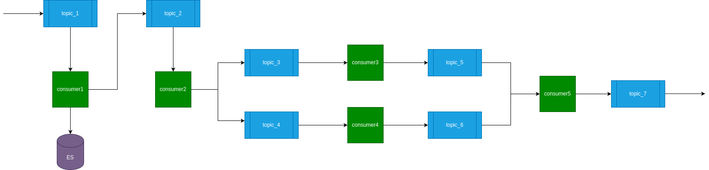

# Consumer Skeleton Project

## Table of Contents

1. [Introduction](#introduction)
2. [Project Structure](#project-structure)
3. [Architecture Overview](#architecture-overview)
4. [Scope of the Project](#scope-of-the-project)
5. [Setup and Installation](#setup-and-installation)
6. [Usage](#usage)
7. [Customization and Implementation](#customization-and-implementation)
8. [Considerations](#considerations)
9. [Future Enhancements](#future-enhancements)

## Introduction

This project provides a template for building Kafka consumers that read messages from one or more Kafka topics, aggregate them based on a common identifier (e.g., `id`), process the aggregated message, and then forward the processed message to one or more output Kafka topics. This skeleton is designed to be easily extendable and customizable, allowing developers to implement specific processing logic by modifying a single function.

## Project Structure

```plaintext
.
├── framework.py          # Core framework for handling Kafka operations
├── worker.py             # Contains the process() function to customize processing logic
├── main.py               # Entry point for running the Kafka consumer
├── models.py             # ORM models and database initialization
├── config.py             # Configuration settings for the database and consumer
├── utils/
│   └── logger.py         # Logger setup for the project
└── README.md             # Project documentation (this file)
```

# Architecture Overview




The architecture of the project is designed to be modular, allowing for easy customization and scaling. The key components are:

1. **Kafka Consumer**: Reads messages from one or more input topics.
2. **Kafka Producer**: Sends processed messages to one or more output topics.
3. **Database Configuration**: Fetches consumer configuration from a database, making the consumer highly configurable.
4. **Message Aggregation**: Aggregates messages from different topics based on a common id.
5. **Processing Logic**: Custom logic implemented in the process() function in worker.py.
6. **Timeout Handling**: Ensures that incomplete message aggregations are discarded after a configurable timeout.

## Scope of the Project

The scope of this project is to provide a template or boilerplate for **QSINT workers** (_Kafka consumers_) that require message aggregation and custom processing logic. The template is designed to be extendable and flexible, allowing developers to easily implement their own processing logic while handling common tasks like message consumption, aggregation, and production.

### Setup and Installation

#### Prerequisites

- Python 3.10+
- MySQL database (or any other SQL database with minor modifications in `models.py`)
- Kafka broker

#### Installation

1. Clone the repository:

```code
git clone https://gitlab-prod.devnet.dcti.ro/serviciul-osint/qsint/consumers/consumer-template
cd consumer-template
```

2. Set up a virtual environment:

```code
python3 -m venv venv
source venv/bin/activate
```

3. Install dependencies

```code
pip install -r requirements.txt
```

4. Configure database (**MySQL**) and Consumer Name

Update the config.py file with your database credentials and Consumer Name:

```code
DB_HOST = 'localhost'
DB_PORT = 3306
DB_NAME = 'your_db_name'
DB_USER = 'your_db_user'
DB_PASSWORD = 'your_db_password'

CONSUMER_NAME = 'consumer_skeleton'
```

### Usage 

#### Running the Consumer
To run the consumer:

```code
python main.py
```

This will start the Kafka consumer, which will begin reading from the input topics, aggregating messages, processing them, and then forwarding them to the output topics.

#### Configuring the Consumer

The consumer configuration is stored in a database table (`consumer_configs`). The `CONSUMER_NAME` in `config.py` determines which configuration to load. The configuration includes:

- **Input Topics**: Topics from which the consumer will read messages.
- **Output Topics**: Topics to which the processed messages will be sent.
- **Kafka Bootstrap Servers**: Kafka brokers to connect to.

#### Example Table Structure

| id  | consumer_name     | topics_input        | topics_output | kafka_bootstrap_server         | metadatas |
|-----|-------------------|---------------------|---------------|--------------------------------|-----------|
| 1   | consumer_skeleton | topic_1,topic_2     | topic_3       | localhost:9092                 | NULL      |

- **`consumer_name`**: A unique identifier for the consumer. This should match the `CONSUMER_NAME` defined in `config.py`.
- **`topics_input`**: A comma-separated list of Kafka topics that the consumer will read from.
- **`topics_output`**: A comma-separated list of Kafka topics to which the processed messages will be sent.
- **`kafka_bootstrap_server`**: Kafka bootstrap server.
- **`metadatas`**: Additional metadata for the consumer (optional).

## Customization and Implementation

### Customizing `process()`

The `process()` function in `worker.py` is where you can implement your custom processing logic. This function receives the aggregated message and is expected to return the processed message that will be forwarded to the output topics.

### Example Customization

#### Customizing `process()` to Call an External API

In many cases, you may want to enrich the message data by calling an external API. The `process()` function can be customized to make such API calls, process the response, and append the result to the `content` of the message.

#### Example Customization: Calling an External API

Here is an example of how you might modify the `process()` function to call an external API and include the API response in the `content` of the message:

```python
import requests
from utils.logger import logger

def process(message, consumer_name):
    """
    Process the Kafka message by calling an external API and appending its result to the content.

    Args:
        message (dict): The aggregated message with fields combined from one or more topics.
        consumer_name (str): The name of the consumer, as defined in `config.py`. This is also the
                             ID of the consumer in the database and is used for logging purposes.

    Returns:
        dict: The final processed message, including the result from the external API.
    """

    # Example: Check if the 'text' field exists and call an external API with this text
    if "text" in message["content"]:
        try:
            # Example API call
            api_url = "https://api.example.com/analyze"
            response = requests.post(api_url, json={"text": message["content"]["text"]})
            
            if response.status_code == 200:
                api_result = response.json()

                # Assume the API returns a dictionary of results that you want to add to the content
                message["content"].update(api_result)

                logger.debug(f"{consumer_name}: API call successful, added {list(api_result.keys())} to content")
            else:
                logger.error(f"{consumer_name}: API call failed with status code {response.status_code}")
        except requests.exceptions.RequestException as e:
            logger.error(f"{consumer_name}: API call failed with exception {e}")
    
    return message
```

Key Considerations When Calling an External API
1. **Error Handling**:
   - Ensure that you handle API errors gracefully. If the API call fails, decide whether to skip the message, retry the API call, or log the error and continue processing.
   - Use appropriate logging to capture both successes and failures of the API calls.
2. **Performance**
   - External API calls can introduce latency into the message processing pipeline. Consider the impact of this latency on your overall system performance and message throughput.
   - If the API response time is critical, you may want to implement asynchronous processing or use a message queue to handle API calls in parallel.
3. **Security**
   - Secure the API call by handling sensitive data appropriately (e.g., API keys, tokens).
   - Ensure that you’re making API calls over HTTPS to protect the data in transit.
4. **Idempotency**
   - Ensure that the `process()` function remains idempotent even when calling an external API. This means that if the same message is processed multiple times, the outcome should be the same.
   - If the API provides non-idempotent results (e.g., returning a timestamp), consider how you will handle these cases.
   
#### Example: Enriching a Message with Sentiment Analysis
Suppose you have an external API that provides sentiment analysis based on text. Here’s how you might integrate it:

```python
def process(message, consumer_name):
    if "text" in message["content"]:
        try:
            # Call the sentiment analysis API
            api_url = "https://api.example.com/sentiment"
            response = requests.post(api_url, json={"text": message["content"]["text"]})
            
            if response.status_code == 200:
                sentiment_result = response.json()

                # Add the sentiment analysis result to the content
                message["content"]["sentiment"] = sentiment_result.get("sentiment")

                logger.debug(f"{consumer_name}: Sentiment analysis added to message")
            else:
                logger.error(f"{consumer_name}: Sentiment analysis API call failed with status {response.status_code}")
        except requests.exceptions.RequestException as e:
            logger.error(f"{consumer_name}: Sentiment analysis API call failed with exception {e}")
    
    return message
```

In this example, the `process()` function calls an external sentiment analysis API, retrieves the sentiment score, and appends it to the message content. The result is then returned and sent to the output Kafka topics.


## Considerations

- **Timeouts**: The `MESSAGE_TIMEOUT` setting in `config.py` controls how long the consumer waits for all expected messages with the same ID to arrive before discarding the incomplete aggregation. Adjust this value based on the expected delay between messages from different topics.
- **Logging**: The project uses a centralized logging setup (via `logger.py`) to capture important events, errors, and debugging information. Make sure to configure the log level appropriately (**DEBUG**, **INFO**, **WARN**, etc.) for your deployment environment.
- **Database Configuration**: The consumer configuration is stored in a database, which allows for flexibility in changing the consumer behavior without modifying the code. Ensure that your database is secured and that access is appropriately controlled.

## Future Enhancements

- **Support for More Databases**: Expand the ORM support to include other databases such as PostgreSQL, SQLite, etc., making the consumer skeleton more versatile.
- **Monitoring and Metrics**: Integrate monitoring tools to track consumer performance, message processing rates, lag, and other key metrics to ensure smooth operation.
- **Error Handling Enhancements**: Improve error handling mechanisms by adding support for retries, dead-letter queues (DLQs), and real-time alerting in case of failures or anomalies.
